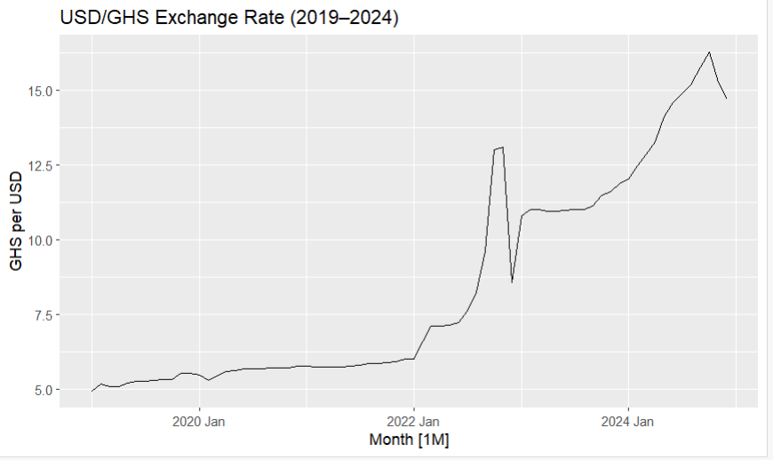
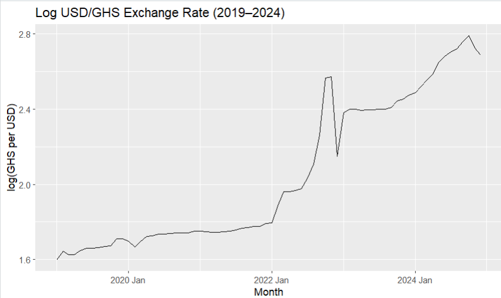
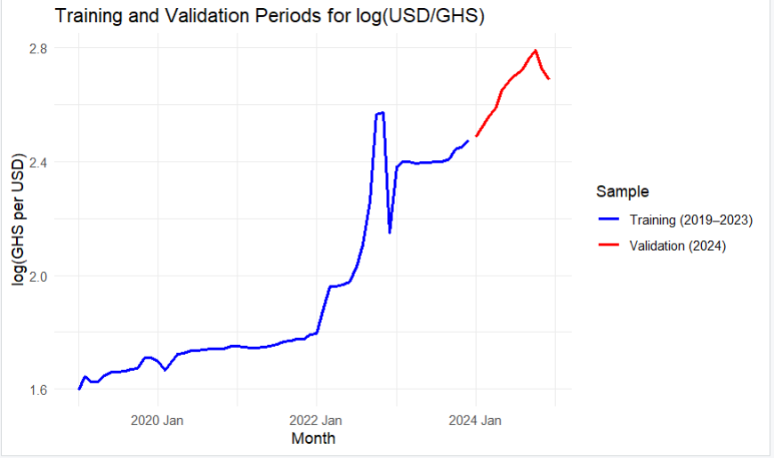
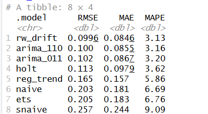
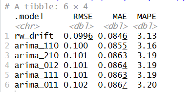
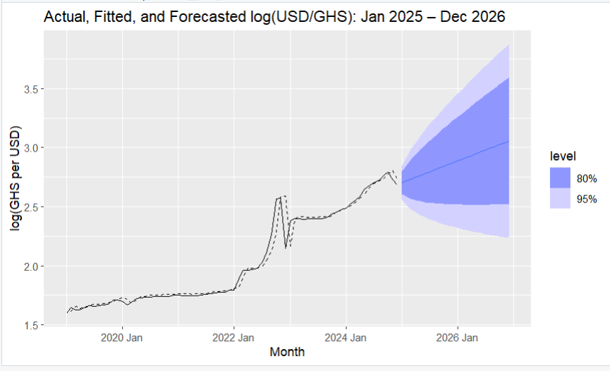

USD/GHS Exchange Rate Forecasting Model
Forecasting the Ghanaian Cedi Against the U.S. Dollar — And What It Means for Businesses
Course: ECON 516 | Author: Princess Johnson | Date: December 2025  
Institution: Eastern Michigan University — MS Applied Economics
---
Project Overview
This project forecasts the monthly nominal USD/GHS exchange rate over a 24-month horizon (January 2025 – December 2026) using six years of official Bank of Ghana data (January 2019 – December 2024).
The central business question driving the analysis:
> *Which currency — the U.S. Dollar or the Ghanaian Cedi — should businesses rely on when pricing and settling international transactions?*
Exchange rate movements directly affect import costs, export revenues, foreign-denominated debt obligations, and the valuation of long-term contracts. Persistent depreciation or volatility in the domestic currency can expose firms to significant financial risk — making accurate forecasting both a quantitative and a strategic challenge.
---
Tools & Technologies
Category	Details
Language	R
Forecasting Models	ARIMA, ETS (Exponential Smoothing), Holt's Linear Trend, Naive, Seasonal Naive, Random Walk with Drift, Combination Forecasts
R Packages	`forecast`, `ggplot2`, `dplyr`, `tseries`
Evaluation Metrics	RMSE, MAE, MAPE
Data Source	Bank of Ghana — Official Monthly Exchange Rate Statistics
Sample Period	January 2019 – December 2024
Forecast Horizon	January 2025 – December 2026 (24 months)
---
Methodology
1. Exploratory Data Analysis
The USD/GHS series was plotted in both levels and log-transformed form to assess trend, seasonality, and structural breaks.

Key observations:
A pronounced upward trend reflecting sustained cedi depreciation over the sample period
No stable or recurring seasonal pattern at the monthly frequency
Two episodes of sharp movement — in 2022 (IMF restructuring, elevated inflation, tightening global conditions) and 2024 (high FX demand and dollar hoarding) — both consistent with exchange rate overshooting rather than predictable cyclical behavior

The log transformation was applied to stabilize variance and allow proportional interpretation of forecast errors.
---
2. Data Partitioning
The dataset was split into training and validation periods for rigorous out-of-sample evaluation:
Training Sample: January 2019 – December 2023
Validation Sample: January 2024 – December 2024

---
3. Forecasting Models Applied
Eight models were estimated on the training data and used to generate forecasts over the validation period:
Benchmarks: Naive, Seasonal Naive
Smoothing Methods: Exponential Smoothing (ETS), Holt's Linear Trend
Regression-Based: Linear Trend (TSLM), ARIMA specifications
Combination: Averaged ETS + ARIMA forecast
Final Model: Random Walk with Drift
---
4. Model Evaluation & Selection
All models were evaluated using RMSE, MAE, and MAPE on the 2024 validation period.

Despite the sophistication of smoothing, regression, and combination methods, none outperformed the Random Walk with drift, which consistently produced the lowest forecast errors across all three metrics.
Additional ARIMA specifications were explored — ARIMA(2,1,0), ARIMA(0,1,2), and ARIMA(1,1,1) — to verify robustness:

None of the refined ARIMA models improved upon the Random Walk with drift, confirming the final model selection.
---
5. Final Forecast — January 2025 to December 2026
The Random Walk with drift model was re-estimated on the full sample (2019–2024) before generating the 24-month forecast.

The forecast shows continued depreciation of the Ghanaian cedi against the U.S. dollar, with prediction interval uncertainty widening appropriately over the forecast horizon. This is consistent with both the historical pattern and established exchange rate theory.
---
Key Findings
The Random Walk with drift outperformed all 7 competing models on RMSE, MAE, and MAPE
More complex models — ETS, ARIMA, Holt's Trend, and combination forecasts — did not deliver superior predictive accuracy
This result is consistent with a substantial empirical literature finding that nominal exchange rates behave like financial asset prices, incorporating information quickly and exhibiting limited predictable structure
The widening prediction intervals over the 24-month horizon correctly reflect the genuine uncertainty inherent in exchange rate forecasting
---
Business Implication
The findings carry a direct and practical recommendation for firms operating in or with Ghana:
> **Businesses should price and settle international transactions in U.S. dollars rather than Ghanaian cedis.**
The persistent depreciation trend in the cedi — combined with its inherent unpredictability — means that GHS-denominated contracts expose firms to significant and largely unhedgeable currency risk over medium and long horizons. USD-denominated pricing and contracts reduce this exposure and provide more stable planning conditions.
While forecasting helps inform strategic planning, risk management strategies such as USD-denominated contracts remain essential given the structural tendency toward cedi depreciation.
---
Repository Structure
```
usdghs-exchange-rate-forecasting/
│
├── README.md                                  — Project overview (this file)
├── usdghs_forecasting.R                       — Full R script
├── 01_USD_GHS_exchange_rate_levels.png        — Raw exchange rate plot
├── 02_USD_GHS_log_transformed.png             — Log-transformed series
├── 03_training_validation_split.png           — Train/validation partition
├── 04_model_accuracy_table_validation.png     — Model comparison results
├── 05_arima_refinement_accuracy_table.png     — ARIMA refinement results
└── 06_final_forecast_random_walk_drift.png    — Final 24-month forecast
```
---
About the Author
Princess Johnson is an Applied Economics MS candidate at Eastern Michigan University (expected May 2026) with experience in financial trading platform operations, econometric research, and data analysis.
Email: pjjohnson2404@gmail.com
LinkedIn: linkedin.com/in/princess-j-johnson-564948219
---
This project was completed as part of ECON 516 at Eastern Michigan University, December 2025.
